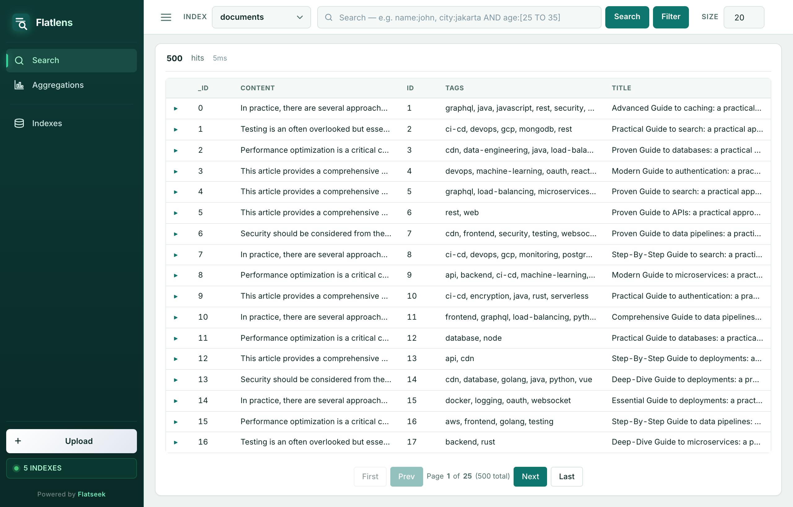

<div align="center">


# Flatseek

**Full text search over flat files.** No JVM. No cluster. No ops burden.

<p align="center">
  
</p>

<p align="center">
  <em>Search, filter, and aggregate CSV/JSON visually — no setup required.</em>
</p>

[](https://www.python.org/downloads/)
[](LICENSE)
[](https://github.com/flatseek/flatseek/actions)
[](https://pypi.org/project/flatseek/)

**Demo:** [flatlens.demo.flatseek.io](https://flatlens.demo.flatseek.io)
&nbsp;&middot;&nbsp;
**Docs:** [flatseek.io/docs](https://flatseek.io/docs)
&nbsp;&middot;&nbsp;
**Benchmark:** [flatbench](https://github.com/flatseek/flatbench/)

</div>

---

## Why Flatseek

- **Correct always.** Every query returns exact counts. No silent wrong results.
- **Single binary.** No JVM, no cluster config, no heap tuning.
- **Fast enough.** p50 2.2ms handles production traffic.
- **Embed or serve.** Use as a library or run as a sidecar API.

---

## Performance

500K rows, article schema, SSD. Flatseek is 2× faster on search than Elasticsearch with exact counts where others silently miss.

| Metric | Flatseek | Elasticsearch |
|--------|----------|---------------|
| Search p50 | **7.9ms** | 16.1ms |
| Range query hits | 501,011 (exact) | 505,044 |
| Build 500K rows | 216s | 113s |

Full comparison (tantivy, typesense, whoosh, zincsearch): [bench.flatseek.io](https://bench.flatseek.io)

---

## Quick Start

```bash
# 1. Install
curl -fsSL flatseek.io/install.sh | sh

# 2. Build index
flatseek build ./data.csv -o ./data

# 3. Serve API + dashboard
flatseek serve -d ./data
# → API:       http://localhost:8000
# → Dashboard: http://localhost:8000/dashboard

# 4. Query
flatseek search ./data "program:raydium AND amount:>1000000"
```

No config files. No cluster.

---

## Core Capabilities

- **Full text search** — tokenized, trigram-backed wildcard (`*kube*`)
- **Range queries** — exact counts on numeric, date, keyword fields
- **Aggregations** — terms, stats, min/max, cardinality, date histogram
- **Array fields** — matches any element (`tags:graphql`)
- **Nested objects** — dot-path queries (`address.city:Jakarta`)
- **Boolean operators** — AND, OR, NOT with grouping
- **Encryption at rest** — ChaCha20-Poly1305
- **Parallel indexing** — multi-worker builds

See [docs/](docs/) for full details.

---

## Docs

| Guide | Description |
|-------|-------------|
| [Quick Start](docs/quickstart.md) | Install, index, query — in 5 minutes |
| [Indexing](docs/indexing.md) | Formats, column types, parallel builds, encrypt |
| [Query Language](docs/query-language.md) | Full syntax reference |
| [CLI Reference](docs/cli.md) | All CLI commands |
| [REST API](docs/api.md) | API endpoints |
| [Schemas](docs/schemas.md) | Supported Column Types |
| [Architecture](docs/architecture.md) | A structural and behavioral map of the Flatseek codebase |
| [Internals](docs/internals.md) | Deep technical breakdown |

---

## Install

### Recommended — one-liner

```bash
curl -fsSL flatseek.io/install.sh | sh
```

Includes API server + Flatlens dashboard (http://localhost:8000/dashboard).

### PyPI

```bash
pip install flatseek
```

CLI only. For Flatlens dashboard: `git clone https://github.com/flatseek/flatlens`

### From source

```bash
git clone https://github.com/flatseek/flatseek.git
cd flatseek && pip install -e .
```

**Requirements:** Python ≥ 3.10, macOS / Linux / WSL.

---

## Contributing

PRs welcome. Run tests:

```bash
pytest src/flatseek/test/test_search.py -v   # accuracy tests (~110 cases)
pytest src/flatseek/test/test_api.py         # API smoke tests
pytest src/flatseek/test/test_cli.py          # CLI integration
```

---

## License

Apache 2.0. See [LICENSE](LICENSE).