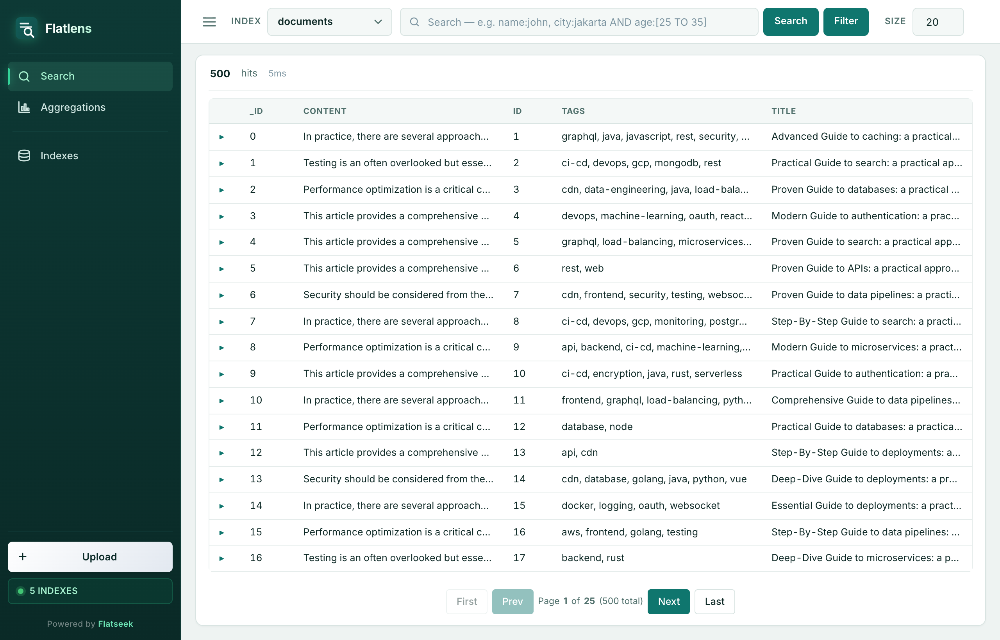

<div align="center">


# Flatseek

**Powerful disk-first full-text search without the infrastructure.**

<p align="center">
  
</p>

<p align="center">
  <em>
Explore, filter, and search structured data at any scale —  
from live application data to historical archives, and AI-ready datasets.
  </em>
</p>

[](https://www.python.org/downloads/)
[](LICENSE)
[](https://github.com/flatseek/flatseek/actions)
[](https://pypi.org/project/flatseek/)

**Demo:** [flatlens.demo.flatseek.io](https://flatlens.demo.flatseek.io)
&nbsp;&middot;&nbsp;
**Docs:** [flatseek.io/docs](https://flatseek.io/docs)
&nbsp;&middot;&nbsp;
**Dashboard:** [Flatlens](https://github.com/flatseek/flatlens)
&nbsp;&middot;&nbsp;
**Benchmark:** [flatbench](https://github.com/flatseek/flatbench)
&nbsp;&middot;&nbsp;
**Hosted Datasets:** [HuggingFace](https://huggingface.co/flatseek)

</div>

---

## See it work

##### Search a 14 GB index hosted on HuggingFace through a serverless API running with only 2 GB of memory.

```bash
# demo CLI
flatseek search https://huggingface.co/datasets/flatseek/public-dataset/resolve/main/6.3M-books.fsk \
  "title:dune"

[reading remote index] ✓
[searching remote] ✓

Found: 1,018 matches

{'name':'Statisticity','author':['Yaron Glazer'],'genres':['Science Fiction'],'...':'...'}
```
```
# demo API

curl -X 'GET' \
  'https://api.demo.flatseek.io/6.3M-books/_search?q=dune&from=0&size=20&bucket=https%3A%2F%2Fhuggingface.co%2Fdatasets%2Fflatseek%2Fpublic-dataset' \
  -H 'accept: application/json'

{"hits":{"total":1018,"hits":[{"_source":{"name":"Statisticity","author":["Yaron Glazer"],"...":"..."}}]},"took":1}
```

That query runs against 6.3M books dataset hosted on HuggingFace, and only pulls the
byte ranges it needs to answer it. The same index also powers the
[Flatlens - live dashboard](https://flatlens.demo.flatseek.io/?bucket=https://huggingface.co/datasets/flatseek/public-dataset&index=6.3M-books&q=dune) — try it with zero installation.

---


## The problem

Distributed search engines like Elasticsearch and OpenSearch are excellent at
large-scale production systems—but they assume always-on infrastructure.

For many workloads, that means paying for 24/7 servers, storage, replicas,
and operational overhead even when you're simply searching documents.

Whether you're powering a production API, exploring a dataset, preparing
training data, building a RAG pipeline, or publishing a searchable archive,
the infrastructure often costs more than the search itself.

Lightweight alternatives avoid the cluster, but they're usually limited to
local files. If your data lives in S3, HuggingFace, or object storage, you still need to download it before you can search it, making remote search harder than it should be.

## What Flatseek does differently

Flatseek uses one query language across two index formats, so the same search
engine works for both live production data and portable datasets.

| | **Directory index** | **`.fsk` archive** |
|---|---|---|
| **Data** | Mutable | Immutable |
| **Best for** | Production APIs, applications, internal analytics | AI & RAG datasets, training data, historical archives, public searchable datasets |
| **Updates** | Inserts, updates, deletes | Rebuild the archive or renew the license |
| **Distribution** | Multi-file index | Single portable file |

Both formats expose the same query language, embedded library, CLI,
and REST API—switching between mutable production data and immutable
archives doesn't require changing your application.

The `.fsk` format packages an entire index into a single portable file,
making it easy to publish on object storage, CDN, or platforms with
file-count limits while preserving the same query capabilities.

---
## Performance at a glance

500K documents • Article schema • SSD • Compared against Elasticsearch

| Metric | Flatseek | Elasticsearch |
|--------|----------:|------------:|
| Search p50 | **7.9ms** | 16.1ms |
| Range query hits | 501,011 (exact) | 505,044 (approximate) |
| Build 500K rows | 216s | **113s** |


Full comparison including tantivy, Typesense, Whoosh, ZincSearch:
[docs/benchmark.md](/docs/benchmark.md) or [bench.flatseek.io](https://bench.flatseek.io)

---

## Core capabilities
| Capability | Description |
|---|---|
| **Full-text search** | Trigram-based search with wildcard, phrase, and boolean queries — [docs/search.md](docs/search.md) |
| **Range queries** | Exact filtering on numeric, date, and keyword fields — [docs/search.md](docs/search.md) |
| **Sorting** | Single or multi-field sorting — [docs/search.md](docs/search.md) |
| **Aggregations** | Terms, stats, cardinality, date histograms — [docs/aggregate.md](docs/aggregate.md) |
| **Nested & array fields** | Query nested objects and match values inside arrays — [docs/search.md](docs/search.md) |
| **Multi-index search** | Query multiple index directories with glob patterns — [docs/multiindex.md](docs/multiindex.md) |
| **Cross-lookup** | Join two indexes on a shared key field — [docs/cross-lookup.md](docs/cross-lookup.md) |
| **Remote indexes** | Search HTTP-hosted indexes without downloading the entire dataset — [docs/storage.md](docs/storage.md) |
| **Embedded library** | Query directly from Python without a server — [docs/python.md](docs/python.md) |
| **REST API** | Elasticsearch-compatible Search, Bulk, and CRUD APIs — [docs/restapi.md](docs/restapi.md) |
| **Write operations** | Insert, upsert, update, delete, bulk — [docs/python.md](docs/python.md) |
| **Parallel indexing** | Multi-worker index builds for faster ingestion — [docs/build.md](docs/build.md) |
| **Compaction** | Reclaim disk space after large delete operations — [docs/cmd.md](docs/cmd.md) |
| **Portable archives** | Package complete indexes into a single `.fsk` file — [docs/cmd.md](docs/cmd.md) |
| **Distribution & licensing** | Public, password-protected, time-limited, or renewable license-based archives — [docs/distribution.md](docs/distribution.md) |
| **Export** | Stream matching documents as JSONL or CSV — [docs/export.md](docs/export.md) |
| **Slice** | Materialize query results as a new standalone index — [docs/build.md](docs/build.md) |
| **Serve & dashboard** | Self-hosted API server with embedded dashboard — [docs/serving.md](docs/serving.md) |

---

## Installation

### Recommended — one-liner

```bash
curl -fsSL flatseek.io/install.sh | sh
```

Includes:
• CLI
• REST API
• Flatlens dashboard (`http://localhost:8000/dashboard`)

### PyPI

```bash
pip install flatseek
```

CLI only. For the [Flatlens dashboard](https://github.com/flatseek/flatlens):

```bash
git clone https://github.com/flatseek/flatlens
```

### From source

```bash
git clone https://github.com/flatseek/flatseek.git
cd flatseek
pip install -e .
```

**Requirements:** Python ≥ 3.10, macOS / Linux / WSL.

---

## Quick start

```bash
# Generate 100K dummy data
flatseek generate -r 100000 -s article -f csv -o ./data.csv

# Build index
flatseek build ./data.csv -o ./data

# Query via CLI
flatseek search ./data "program:raydium AND amount:>1000000"

# Serve API + dashboard
flatseek serve -d ./data

# Pack index into single portable .fsk file
flatseek pack ./data -o ./data.fsk

# Query from portable file
flatseek search data.fsk "program:raydium AND amount:>1000000"

# Serve API + dashboard from portable file
flatseek serve data.fsk

# Query a .fsk archive directly from HTTP — no full download
flatseek search https://huggingface.co/datasets/owner/repo/resolve/main/data.fsk "program:raydium AND amount:>1000000"

# Serve a .fsk archive directly from HTTP — no full download
flatseek serve https://huggingface.co/datasets/owner/repo/resolve/main/data.fsk

# Export results
flatseek export ./data "program:raydium AND amount:>1000000" -f jsonl --out exported.jsonl
flatseek export data.fsk "program:raydium AND amount:>1000000" -f jsonl --out exported.jsonl

```

→ API: [http://localhost:8000](http://localhost:8000)
→ Dashboard: [http://localhost:8000/dashboard](http://localhost:8000/dashboard)

---

## Remote datasets

Build an index once, upload it to any HTTP-accessible storage, and query it
from anywhere using the same embedded library, CLI, or REST API.

Flatseek reads only the byte ranges required to answer each query, so even
large indexes can be searched remotely without downloading the entire file.

**Supported providers:**

- HuggingFace Datasets / Buckets
- S3-compatible storage (Amazon S3, MinIO, Cloudflare R2)
- Vercel Blob
- Any static HTTP server or CDN

**Try it now:** Use the live dashboard at
[flatlens.demo.flatseek.io](https://flatlens.demo.flatseek.io) to explore
remote `.fsk` indexes directly from your browser—no installation required.

---

## Example indexed datasets

All datasets below are hosted on HuggingFace. The Flatseek API serving the
dashboard is deployed on a free Vercel hobby account — and it searches a
14 GB index in under 5 seconds by fetching only the byte ranges it needs.

| Dataset | Index Size | Documents | Index File | Try in Flatlens |
|---|---:|---:|---|---|
| **6.3M Books** | 14.1 GB | 6.3M Goodreads books | [Download](https://huggingface.co/datasets/flatseek/public-dataset/blob/main/6.3M-books.fsk) | [Open →](https://flatlens.demo.flatseek.io/?bucket=https://huggingface.co/datasets/flatseek/public-dataset&index=6.3M-books) |
| **1.2M Movies** | 2.1 GB | 1.2M TMDB movies | [Download](https://huggingface.co/datasets/flatseek/public-dataset/blob/main/1.2M-movies.fsk) | [Open →](https://flatlens.demo.flatseek.io/?bucket=https://huggingface.co/datasets/flatseek/public-dataset&index=1.2M-movies) |
| **5M Wikipedia** | 1.39 GB | 5M Wikipedia articles | [Download](https://huggingface.co/datasets/flatseek/public-dataset/blob/main/5M-wikipedia.fsk) | [Open →](https://flatlens.demo.flatseek.io/?bucket=https://huggingface.co/datasets/flatseek/public-dataset&index=5M-wikipedia) |
| **1.2M Songs** | 947 MB | 1.2M Spotify tracks | [Download](https://huggingface.co/datasets/flatseek/public-dataset/blob/main/1.2M-songs.fsk) | [Open →](https://flatlens.demo.flatseek.io/?bucket=https://huggingface.co/datasets/flatseek/public-dataset&index=1.2M-songs) |
| **500K Startups** | 600 MB | 500K Product Hunt launches (2013–2026) | [Download](https://huggingface.co/datasets/flatseek/public-dataset/blob/main/500k-startups.fsk) | [Open →](https://flatlens.demo.flatseek.io/?bucket=https://huggingface.co/datasets/flatseek/public-dataset&index=500k-startups) |
| **800K Domains** | 539 MB | 800K WHOIS domain registrations | [Download](https://huggingface.co/datasets/flatseek/public-dataset/blob/main/800k-domains.fsk) | [Open →](https://flatlens.demo.flatseek.io/?bucket=https://huggingface.co/datasets/flatseek/public-dataset&index=800k-domains) |
| **500K Actors** | 84.2 MB | 500K movie actors | [Download](https://huggingface.co/datasets/flatseek/public-dataset/blob/main/500k-actors.fsk) | [Open →](https://flatlens.demo.flatseek.io/?bucket=https://huggingface.co/datasets/flatseek/public-dataset&index=500k-actors) |
| **271K Athletes** | 75.6 MB | 271K Olympic athletes (1800–2000) | [Download](https://huggingface.co/datasets/flatseek/public-dataset/blob/main/271k-athletes.fsk) | [Open →](https://flatlens.demo.flatseek.io/?bucket=https://huggingface.co/datasets/flatseek/public-dataset&index=271k-athletes) |

---

## Distribution & Licensing

Flatseek supports four distribution models, depending on your distribution and access-control requirements.

| Model | Format | Index File | Encryption | Expiration | Access Renewal |
|---|---|---|---|---|---|
| **Public** | Folder | [sample-articles](https://huggingface.co/datasets/flatseek/sample-articles) | None | Never | — |
| **Password-Protected** | Folder | [sample-encrypted](https://huggingface.co/datasets/flatseek/sample-encrypted) | Per-file ChaCha20 | Never | Change the passphrase |
| **Time-Limited** | Single `.fsk` | [demo_enclosed_active](https://huggingface.co/datasets/flatseek/sample-distributions) | Full-file ChaCha20 | Fixed date | Must repack the archive |
| **License-Based** | Single `.fsk` | [demo_license](https://huggingface.co/datasets/flatseek/sample-distributions) | Section-level ChaCha20 | Renewable token | Issue a new token — no repack needed |

**Key difference — time-limited vs. license-based:** when a time-limited
archive expires, you must repack it from existing non-fsk index to extend access. When a
license-based archive expires, you issue a new HMAC token — the index
itself stays unchanged.

> The credentials below are public demo credentials for the samples above — not secrets.

| Model | Dashboard link | Credentials |
|---|---|---|
| Public folder | [sample-articles →](https://flatlens.demo.flatseek.io/?bucket=https://huggingface.co/datasets/flatseek&index=sample-articles) | None |
| Password-protected folder | [sample-encrypted →](https://flatlens.demo.flatseek.io/?bucket=https://huggingface.co/datasets/flatseek&index=sample-encrypted) | Passphrase: `flatseek` |
| Time-limited `.fsk` | [demo_enclosed_active →](https://flatlens.demo.flatseek.io/?bucket=https://huggingface.co/datasets/flatseek/sample-distributions&index=demo_enclosed_active) | Passphrase: `flatlens_demo_enclosed` |
| License-based `.fsk` | [demo_license →](https://flatlens.demo.flatseek.io/?bucket=https://huggingface.co/datasets/flatseek/sample-distributions&index=demo_license) | Token: `ZGVtby11c2VyfDE4MTQ3NDU2MDB8MHxtUkJaTkN4WUdLeWhrV2NUMGN3Wlo0MkhUc1IvelNpYXBzUGo4a2tZdVhzPQ==` |

---

## Full Documentation

| Guide | Description |
|-------|-------------|
| [Quick Start](docs/quickstart.md) | Install, index, query — in 5 minutes |
| [Indexing](docs/indexing.md) | Formats, column types, parallel builds, encryption |
| [Query Language](docs/query-language.md) | Full syntax reference |
| [CLI Reference](docs/cli.md) | All CLI commands |
| [REST API](docs/restapi.md) | API endpoints |
| [Search](docs/search.md) | Full-text, wildcard, range, boolean, nested/array queries |
| [Aggregations](docs/aggregate.md) | Terms, stats, date histogram, cardinality |
| [Multi-Index](docs/multiindex.md) | Wildcard search across multiple index directories |
| [Cross-Lookup](docs/cross-lookup.md) | Join two indexes on a shared key field |
| [Python Library](docs/python.md) | Query, insert, upsert, update, delete, bulk from Python |
| [Export](docs/export.md) | Stream matching documents as JSONL or CSV |
| [Serve & Dashboard](docs/serving.md) | Self-hosted API server with embedded dashboard |
| [Remote Storage](docs/storage.md) | HuggingFace, S3, Vercel Blob backends |
| [Distribution](docs/distribution.md) | Public, password-protected, time-limited, or license-based archives |
| [Schemas](docs/schemas.md) | Supported column types |
| [Architecture](docs/architecture.md) | Structural and behavioral map |
| [Internals](docs/internals.md) | Deep technical breakdown |
| [Tests](docs/tests.md) | Test coverage matrix and gap analysis |

---

## Contributing

PRs welcome. Run tests:

```bash
pytest tests/ -v          # all tests
```
---
## License

Apache 2.0. See [LICENSE](LICENSE).